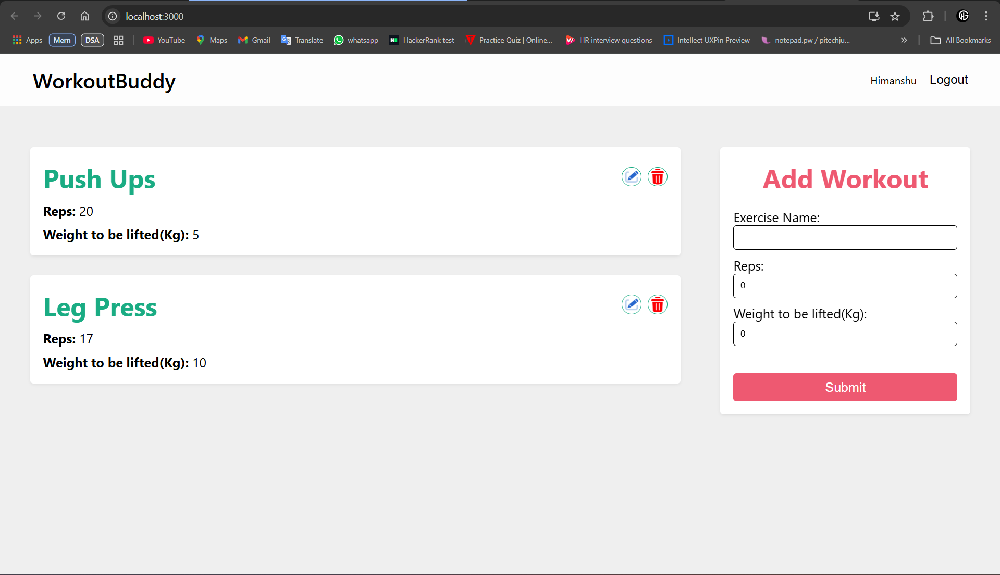
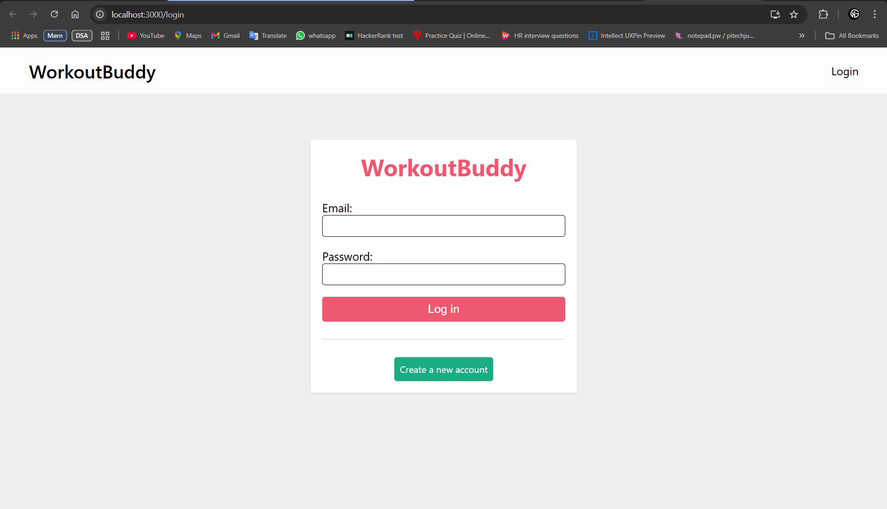

# WorkoutBuddy | Version: 1.0

 - WorkoutBuddy is a web application that helps you to keep track of your home workouts without any problems. 
 - It allows you to add a new workout, edit an existing workout, or delete a workout.
 - User credentials are secured using 10-bit Hashing with a JWT token.
 - The user can access their dashboard only after successfully logging.
 - It uses cookies to keep login of the user for efficient and fast CRUD operations. 
 - It is a lightweight and simple application.

## Languages used :

This app is built with React, using JavaScript, Node.js, and Express.js for the backend and MongoDB for the database.

# UI:

## Quick start :

All you have to do to open the application is to go to the [WorkoutBuddy](https://WorkoutBuddy.netlify) website, then log in if you have an  account, else sign up.
After successful login, you can use this application.

## Credits :

I've worked alone on this project. If you have any requests, questions, suggestions, or feedback, feel free to contact me using the Contact page - the link will be added later. I've written every single line of code for this project. For now, you can contact me via email: himanshu.guptaji07@gmail.com.

## License :

The license will be added later, once the project has progressed enough.

## Notice :

The notice will be created at a later date, at the same time as the license.
